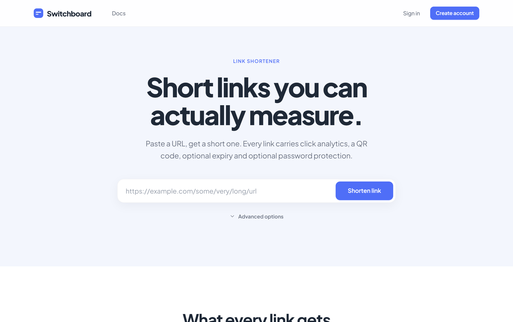
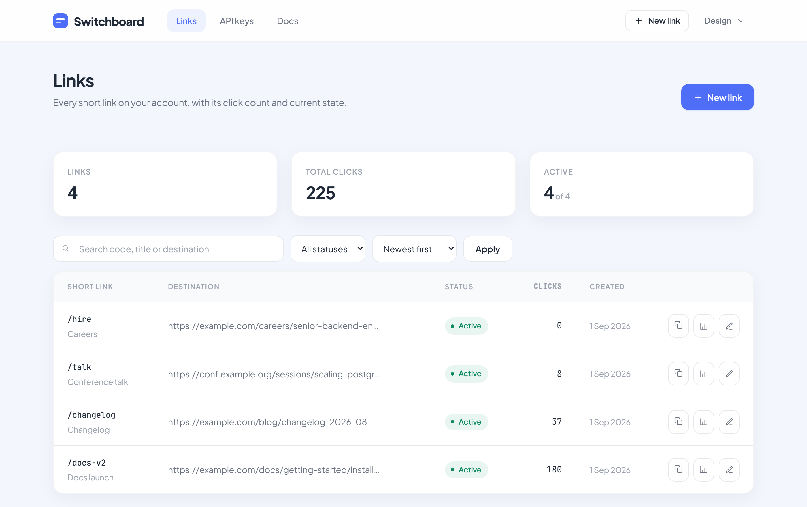
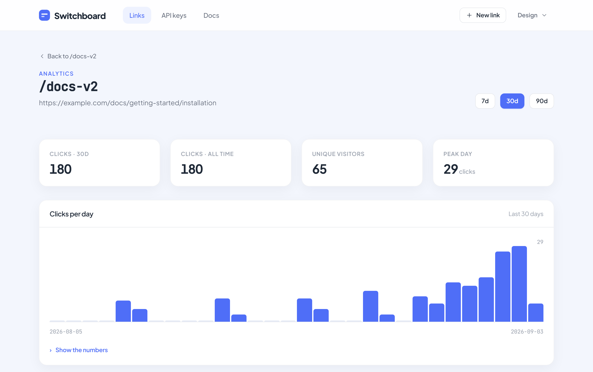

# Switchboard

A link shortener that tells you what happened next.

Paste a long URL, get a short one. Every link comes with a QR code and click
analytics — where people came from, what they used, when they clicked.

**Live at [switchboard.jasgun.me](https://switchboard.jasgun.me)**



---

## What it does

**Shortens links.** `switchboard.jasgun.me/mm` instead of something 200
characters long. Codes stay as short as possible and only grow when they need
to.

**Custom names.** Claim `/portfolio` or `/resume` instead of a random code.

**Tracks clicks.** Countries, devices, browsers, operating systems, and where
the click came from.

**QR codes.** Generated for every link, ready to download.

**Expiry dates.** Set a time after which a link stops working. Good for
campaigns and anything time-limited.

**Password protection.** Put a password in front of a link. Visitors enter it
before being redirected.

**A REST API.** Create and manage links from a script instead of the browser.

<table>
<tr>
<td width="50%"></td>
<td width="50%"></td>
</tr>
<tr>
<td><em>All your links in one place.</em></td>
<td><em>What happened to each one.</em></td>
</tr>
</table>

---

## Built with

Django · PostgreSQL · Redis · Celery · nginx

No JavaScript framework and no build step — the pages are server-rendered
templates with a single stylesheet.

---

## Run it on your machine

You need Python 3.10 or newer. Redis is optional; without it the site is just
a little slower.

```bash
cd backend
python -m venv .venv
.venv/bin/pip install -r requirements-dev.txt
cp .env.example .env
.venv/bin/python manage.py migrate
.venv/bin/python manage.py createsuperuser
```

Open `backend/.env` and set `DJANGO_DEBUG=1`.

It runs as two programs, so you need two terminals:

```bash
# Terminal 1 — the website
DJANGO_ROOT_URLCONF=config.urls_web python manage.py runserver 8000

# Terminal 2 — the short links themselves
DJANGO_ROOT_URLCONF=config.urls_redirect python manage.py runserver 8001
```

Then open **http://localhost:8000**.

> On Windows the commands are `.venv\Scripts\python.exe` and you set variables
> with `$env:DJANGO_ROOT_URLCONF = "config.urls_web"`.

### Running the tests

```bash
cd backend
.venv/bin/python manage.py test tests
```

141 tests, no Redis or database server required.

---

## Putting it on a server

**[deploy/DEPLOY.md](deploy/DEPLOY.md)** walks through a blank VPS from scratch
— every command written out, with what you should see after each one. It
assumes you have never set up a server before.

---

## How it works underneath

**[docs/ARCHITECTURE.md](docs/ARCHITECTURE.md)** covers the design decisions:
why it runs as two separate applications, how short codes stay unique when two
people ask for the same one at the same moment, what Redis and Celery are
actually doing, and the trade-offs that were made on purpose.

---

## Licence

MIT — see [LICENSE](LICENSE). Do what you like with it.


---

## Support

If you find this project useful, you can support my work by buying me a chai.

<a href="https://buymeachai.ezee.li/Jasgunsingh">
  
</a>

